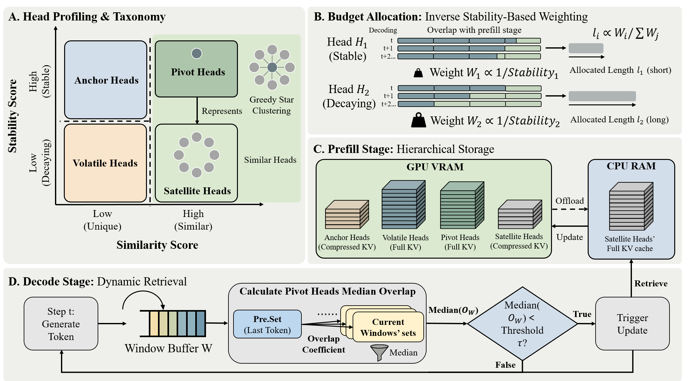

# [ACL 2026] HeteroCache: A Dynamic Retrieval Approach to Heterogeneous KV Cache Compression for Long-Context LLM Inference

<p>
  <a href="https://arxiv.org/abs/2601.13684">
    
  </a>
</p>



## 📖 Abstract
The linear memory growth of the KV cache poses a significant bottleneck for LLM inference in long-context tasks. Existing static compression methods often fail to preserve globally important information. Although recent dynamic retrieval approaches attempt to address this issue, they typically suffer from coarse-grained caching strategies and incur high I/O overhead. To overcome these limitations, we propose HeteroCache, a training-free dynamic compression framework. Our method is built on two key insights: attention heads exhibit diverse temporal heterogeneity, and there is significant spatial redundancy among heads within the same layer.
Guided by these insights, HeteroCache categorizes heads based on stability and similarity, applying a fine-grained weighting strategy that allocates larger cache budgets to heads with rapidly shifting attention to capture context changes.
Furthermore, it features a hierarchical storage mechanism where representative heads monitor attention drift to trigger asynchronous, on-demand context retrieval, thereby hiding I/O latency.
Experiments demonstrate that HeteroCache achieves state-of-the-art performance on long-context benchmarks and accelerates decoding by up to $3\times$ compared to the original model with a 224K context.

## 🔧 Supported Methods

HeteroCache currently supports the following KV cache compression methods:

### ✅ Available
- **HeteroCache** (native implementation)
- **FullKV**
- **StreamingLLM**
- **H2O**
- **SnapKV**
- **PyramidKV**
- **CAKE**

### ⏳ Other Methods
These methods are planned for future integration into HeteroCache code.  
In the meantime, you can evaluate them using their official repositories:

- **[Quest](https://github.com/mit-han-lab/quest)** — Query-Aware Sparsity for Efficient Long-Context LLM Inference
- **[ShadowKV](https://github.com/ByteDance-Seed/ShadowKV)** — KV Cache in Shadows for High-Throughput Long-Context LLM Inference
- **[OmniKV](https://github.com/antgroup/OmniKV)** — Dynamic Context Selection for Efficient Long-Context LLMs


## ✅ Supported Models

HeteroCache currently supports **Llama** and **Qwen** model families. Support for additional architectures can be easily added by extending the model interface.

## 🛠️ Installation

```bash
conda create -n heterocache python=3.10 -y
conda activate heterocache
pip install -r requirements.txt
pip install flash-attn==2.7.4.post1 --no-build-isolation
```

## 🚀 Evaluation

### Step 1: Prepare Datasets

Place the datasets in the following directories before running evaluation:

| Benchmark | Source | Target Directory |
|-----------|--------|-----------------|
| LongBench | [zai-org/LongBench](https://huggingface.co/datasets/zai-org/LongBench) | `data/longbench/` |
| LongBench v2 | [zai-org/LongBench-v2](https://huggingface.co/datasets/zai-org/LongBench-v2) | `data/longbenchv2/` |
| InfiniteBench | [xinrongzhang2022/InfiniteBench](https://huggingface.co/datasets/xinrongzhang2022/InfiniteBench) | `data/infinitebench/` |

### Step 2: Cluster

Before running any evaluation, you need to extract attention weights and cluster attention heads. These steps analyze the model's attention patterns to classify heads as anchor/volatile and pivot/satellite, which HeteroCache relies on at inference time.

**Extract attention weights**

```bash
python tools/get_weights.py \
  --model_path /path/to/model \
  --dataset_path tools/data/wiki_demo.txt \
  --tensor_save_dir ./tensor \
  --max_length 5000 \
  --max_new_tokens 100
```


**Cluster attention heads**

```bash
python tools/get_cluster.py \
  --tensor_save_dir ./tensor \
  --model_path /path/to/model \
  --stable_threshold 0.5 \
  --sim_threshold 0.5
```


### Step 3: Run Evaluation

**InfiniteBench:**

Inference:
```bash
# HeteroCache
bash scripts/infinitebench/eval_heterocache.sh --model_path ../models/Llama-3.1-8B-Instruct --compression_ratio 0.5 --steps 5 --decode_step 5000 --topk 1024 --stable_threshold 0.5 --sim_threshold 0.5
```
```bash
# Other methods (e.g., FullKV, CAKE)
bash scripts/infinitebench/eval.sh --model_path ../models/Llama-3.1-8B-Instruct --method FullKV --compression_ratio 0.5
```

Evaluation:
```python
python scripts/infinitebench/compute_scores.py --output_dir ./results/infinitebench --model_path ../models/Llama-3.1-8B-Instruct --method HeteroCache
```

**LongBench:**

Inference:
```python
# HeteroCache
PYTHONPATH=./ python scripts/longbench/run_longbench.py --model_path ../models/Llama-3.1-8B-Instruct --save_dir ./results/longbench --method HeteroCache --real_offload --compression_ratio 0.5 --steps 5 --decode_step 5000 --topk 1024 --stable_threshold 0.5 --sim_threshold 0.5
```
```python
# Other methods (e.g., FullKV, CAKE)
PYTHONPATH=./ python scripts/longbench/run_longbench.py --model_path ../models/Llama-3.1-8B-Instruct --save_dir ./results/longbench --compression_ratio 0.5 --method CAKE
```

Evaluation:
```bash
bash scripts/longbench/metrics.sh ./results/longbench/YOUR_PATH
```

**LongBench v2:**

Inference:
```python
# HeteroCache
python scripts/longbenchv2/pred.py --model_path ../models/Llama-3.1-8B-Instruct --save_dir ./results/longbenchv2 --method HeteroCache --real_offload --compression_ratio 0.5 --decode_step 5000 --steps 5 --topk 1024 --stable_threshold 0.5 --sim_threshold 0.5
```

```python
# Other methods (e.g., FullKV, CAKE)
python scripts/longbenchv2/pred.py --model_path ../models/Llama-3.1-8B-Instruct --save_dir ./results/longbenchv2 --compression_ratio 0.5 --method CAKE
```


Evaluation:
```bash
python scripts/longbenchv2/result.py --input_dir ./results/longbenchv2/ --output_file ./results/longbenchv2/result.txt
```


## ⏱️ Latency Test

```bash
bash scripts/test_latency/get_latency.sh
```

## 📌 Citation

If you find our work helpful, please consider citing:

```bibtex
@article{shi2026heterocache,
  title={HeteroCache: A Dynamic Retrieval Approach to Heterogeneous KV Cache Compression for Long-Context LLM Inference},
  author={Shi, Zhiyuan and Qiu, Qibo and Xue, Feng and Jiang, Zhonglin and Yu, Li and Jiang, Jian and He, Xiaofei and Wang, Wenxiao},
  journal={arXiv preprint arXiv:2601.13684},
  year={2026}
}